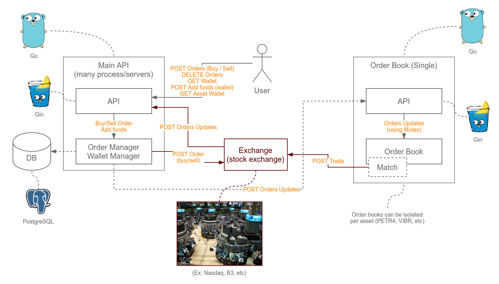

# Home Broker

This a simple order book system for Golang study.

The system has two parts: **main API** and **order book**.


## Main API

The main API manages the **wallets** (money) and **assets** (as AMZN, PETR4, etc.) of users. It also receives the orders updates from an exchange (stock exchange). These updates may have been generated by users from this system or by others on other platforms (others home brokers).

- Send buying or selling orders (bids/asks) to an exchange.
- Add funds to the users wallets.
- Receives updates from the exchange (bids/asks).
- Updates the order records if these updates are from this system.


## Order book

The order book organizes the orders into buying and selling lists. When two orders of buying and selling "match" it requests a "trade" to the Stock Exchange API (ex. Nasdaq). This does not credit or debit users' wallets/assets yet, the "trade" confirmation will return in the form of updates sent by the Exchange.

The Exchange will continually send updates about the current stocks/assets offers and the order book must verify which orders generates trades.

Usually an order book system does not accept concurrency and can receive thousands of requests per second. The algorithm must be extremely fast to handle this data structure. Besides the API uses Goroutines to handles requests (Gin Framework), but the order book updates uses mutex to avoid concurrency.

To scale it is possible to have mutiples servers/instances of orders books, each one handling a group of assets.

> Unfortunaly at the moment it possible only one asset per order book/process using "--asset-id" option.

You can get more information about order book here:

 - https://around25.com/blog/building-a-trading-engine-for-a-crypto-exchange/
 - https://lobsterdata.com/info/DataStructure.php

## Diagram



Notice that this is not the desired architecture. The communication should be done with Kafka or similar, but it was not implemented at the moment.

## The development

The main stack is composed by Golang (Gin, Gorm, SQLMock, Gomock) and PostgreSQL.

We try to avoid dependecies on databases or frameworks. The PostgreSQL and Gin can be easily changed just implementing the *interfaces* (abstract classes). You don't need to change anything else on the system.

The source is divide in modules (users, wallets, orders, etc). Each module has its own set of implementations for PostgreSQL and Gin as subdirectories "implem".

Examples:

- users/business_rules_and_interfaces.go
- users/implem/postgresql/implementations.go
- users/implem/gin/implementations.go
- users/implem/another_framework_or_db/implementations.go

> In this example "postgresql/implementations.go" and "gin/implementations.go" uses the interfaces (abstract classes) of "business_rules_and_interfaces.go". To add a new DB just implement the interfaces and set the selected DB on the start up (e.g. by config or shell parameter).

## Assumptions

Some important assumptions have been made:

- We assume that this business rely on an Exchange API service (stock exchange or a third party broker) to send and receives the bids, asks and trades. This is probably the most important assumption we've made. Basically our order book just keep the state based on the exchange updates. When we find a "match" we send a trade request to the exchange. This trade can be accepted or not. When it is accepted the credit/debit the money and assets if the user is from our platform.
- Users will be handled by another service (or microsevice). That's why we believe that the sent ID is always correct and we just insert it in the database. We don't check whether the user exists or not, we just "upsert" the user.
- We don't use float ou decimal data types for money or assets amount. We are using a **int64** where the 6 rightest digits are the "decimal" part. For example, the value **$1.99 is represented as 1990000**. The amount of assets also follow up this pattern as some types of assets can the have fractions.
- Only one asset is created on migration, the "VIBR" (Vibranium). In future works this can be done using an API.

## Running with Docker

Building the image.

```bash
make docker

# OR:
# docker build -t yoshiodeveloper/homebroker:latest -t homebroker:1.0 --build-arg build= --build-arg version=1.0 -f Dockerfile --no-cache .
```

Running the main API:

```bash
# Create a network for the database, api and order book.
docker network create homebroker-net

# Create the database container.
docker run --rm --network homebroker-net --name homebrokerpg -e POSTGRES_DB=homebroker -e POSTGRES_USER=homebroker -e POSTGRES_PASSWORD=123456 -d postgres

# Create the migrations.
docker run --rm --network homebroker-net -e "DBHOST=homebrokerpg" yoshiodeveloper/homebroker:latest migrate

# Start the order book on port 8001
docker run --rm --network homebroker-net --name orderbook -p 8081:8080 yoshiodeveloper/homebroker:latest orderbook

# Start the API on port 8080
docker run --rm --network homebroker-net -p 8080:8080 -e "DBHOST=homebrokerpg" yoshiodeveloper/homebroker:latest api -o "http://orderbook:8080"
```

## Running and building (go building)

Just run make.

```bash
make
```

Playing with "go run".

```bash
# With PostgreSQL running (see env vars)

go run main.go migrate

go run main.go orderbook (--asset-id VIBR)

go run main.go api -o "http://orderbook:8080"
```

## API

---
**GET /api/v1/wallets/USER_ID/**

Returns an user wallet. A new user and an empty wallet are created on the first call.

----

**POST /api/v1/wallets/USER_ID/add-funds/**

Adds funds (money) to an user wallet. The user and wallet are created on the first call.

Body:

```json
{ "amount": 999000000 }  // adds $999.00 (0000)
```
---

**GET /api/v1/wallets/USER_ID/assets/ASSET_ID/**

Returns the asset wallet of a user. Ex VIBR (Vibranium).

---

**GET /api/v1/orders/ORDER_ID/**

Returns an order (bid/ask) detail.

---

**POST /api/v1/orders/buy/  and POST /api/v1/orders/sell/**

Creates a "buy" or "sell" (buy/ask) request.  This sends a request on the exchange.

Body:

```json
{
    "user_id": 999
    "asset_id": "VIBR",
    "price": 999000000,  // $999.00
    "amount": 100000000,  // 100.000000
}
```

> This process should be assyncronous using a message broker. The "order" entity already has a field "status" to hold "pending", "accepted" and "denied" steps.

> Notice that this doesn't create any order into the order book as we don't have a real exchange sending the updates. The steps are "send bids/asks requests" --> "exchange" --> "send bids/asks updates" --> "our API" --> "order book".

---


**POST /api/v1/orders/webhook/**

This endpoint receives the exchange updates. After that the updates are send to order book API.

Body:

```json
{
    "id": "EX-897",       // The exchange order ID (external ID)
    "asset_id": "VIBR",   // The asset ID
    "price": 999000000,   // $999.00 (0000)
    "amount": 100000000,  // 100.000000
    "type": "buy",        // buy/sell
    "timestamp": "2020-09-21T00:14:14.026337-03:00",  // the date/time event on the exchange
    "action": "added"     // added/deleted/traded
}
```

**POST /api/v1/orderbooks/ASSET_ID/webhook/**

Receives the updates to change the state of the order book. This is sent by the Main API (that receives from the exchange).

Body:

```json
{
    "mine": true,         // An order created from this platform
    "id": "EX-897",       // The exchange order ID (external ID)
    "asset_id": "VIBR",   // The asset ID
    "price": 999000000,   // $999.00 (0000)
    "amount": 100000000,  // 100.000000
    "type": "buy",        // buy/sell
    "timestamp": "2020-09-21T00:14:14.026337-03:00",  // the date/time event on the exchange
    "action": "added"     // added/deleted/traded
}
```

After an update the order book try to find a match to the order offers.

The field "mine" indicates if this order refers to an order created by this platform. This is necessary because we are receiving orders updates from all others users from others brokers. We can only do trades with ours users orders.

> After a "match" the system try to do a trade. This creates a request on the exchange API, but this should be assyncronous.


## Environment variables

| Name | Default value | Description
| -- | -- | -- |
| DBHOST | localhost | DB host |
| DBPORT | 5432  | DB port |
| DBNAME | homebroker | DB name |
| DBUSER | homebroker | DB username |
| DBPASSWORD | 123456 | DB password |
| GINMODE or GIN_MODE | debug | Webserver mode. Leave "release" for production. |
| GINPORT or PORT | 8080 | DB port | Webserver port.


## Tests

```bash
make test
```

> Unfortunaly I couldn't create tests for all cases. This is my first time coding, testing and mocking in Go and this process was a huge time consuming.

## Contact

- (13) 99727-6989
- geanyoshio@gmail.com
